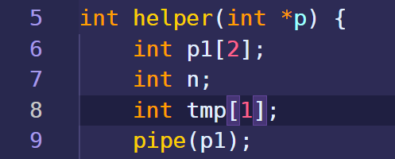
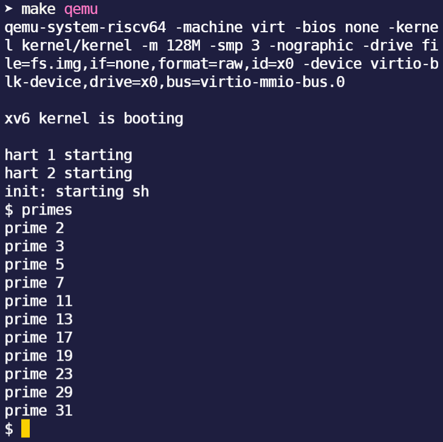
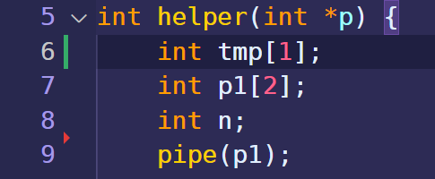
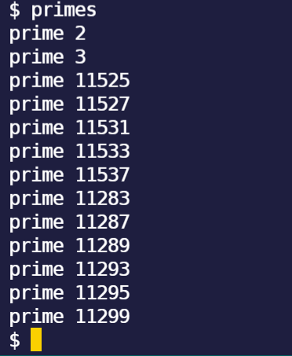

* TOC
{:toc}
# 课程简介

MIT新出的操作系统课，和6.828一样都用xv6，但是对我来说，这个更好做一些。


<!-- more -->


# 环境配置

我用的是ArchLinux，在win10的VMware虚拟机里面安装的。

```sh
sudo pacman -S riscv64-linux-gnu-binutils riscv64-linux-gnu-gcc riscv64-linux-gnu-gdb qemu-arch-extra
```

但是，Arch的软件包太新了，尤其是qemu的版本，太新了，所以需要把qemu和依赖的liburing包降级，降级使用downgrade这个软件，qemu降级到5.1版本，liburing到0.7版本。downgrade可以用yay安装。

```sh
sudo yay -S downgrade
```

# 主要内容

## sleep(easy)

```c++
int sleep(int n) //Pause for n clock ticks
```

```c++
#include "kernel/types.h"
#include "user/user.h"

int main(int argc, char const *argv[])
{
    /* code */
    if (argc <= 1) {
        fprintf(2, "error: you must type a number!\n");
    }
    else if (argc == 2) {
        int number = atoi(argv[1]);
        sleep(number);
    }
    exit(0);
}
```

代码没啥难度，确实是easy

## pingpong(easy)

```c++
int fork() //Create a process, return child's PID
int pipe(int p[]) //Create a pipe, put read/write file descriptors in  p[0] and [1]
int read(int fd, char *buf, int n) //Read n byte into buf;returns number read;or 0 if end of file
int write(int fd, char *buf, int n) //Write n bytes from buf to file descriptor fd;returns n
```

这个不像easy啊，不过要是把xv6-book开头几页读一读，也就easy了。主要难度在理解fork上，父进程和子进程得到的是不同的fork返回值，子进程得到的是0，用这个区分两者的代码。

```c++
#include "kernel/types.h"
#include "kernel/stat.h"
#include "user/user.h"

int main(int argc, char const *argv[])
{
    /* code */
    int p1[2];
    int p2[2];
    pipe(p1);
    pipe(p2);

    int pid = fork();
    if (pid > 0) {
        // printf("current pid: %d\n", getpid());
        // printf("parent: child=%d\n", pid);

        write(p1[1], "z", 1);
        char tmp_father[1];
        // read(p1[1], tmp_father, 1);
        if (read(p2[0], tmp_father, 1) >= 0) {
            printf("%d: received pong\n", getpid());
        }
        // pid = wait((int *) 0);
        // printf("child %d is done\n", pid);
    }
    else if (pid == 0) {
        // sleep(10);
        // printf("current pid: %d\n", getpid());

        char tmp_child[1];
        // read(p1[0], tmp_child, 1);
        if (read(p1[0], tmp_child, 1) >= 0) {
            printf("%d: received ping\n", getpid());
        }
        write(p2[1], tmp_child, 1);
        // printf("child: exiting\n");
        exit(0);
    }
    else {
        printf("fork error\n");
    }
    
    exit(0);
}
```


## primes(moderate/hard)

这个程序用到了fork，pipe，wait，read，write，把数据都写入管道之后，要把p[1]给他close，这样read的时候，返回值会变成0，就可以判断出数据到头了。

这个程序废了好大劲才做出来，不过靠自己一个人做出来，忍住不看其他人的方法，是非常有成就感的。

```c++
#include "kernel/types.h"
#include "kernel/stat.h"
#include "user/user.h"

int helper(int *p) {
    int p1[2];
    int n;
    int tmp[1];
    pipe(p1);

    if (read(p[0], tmp, 1) != 0) {
        n = tmp[0];
        printf("prime %d \n", tmp[0]);
    }
    else {
        exit(0);
    }

    while(read(p[0], tmp, 1) != 0) {
        // printf("current pid: %d\n", getpid());
        // printf("tmp[i]: %d\n", tmp[0]);
        if (tmp[0] % n != 0) {
            write(p1[1], tmp, 1);
        }
    }
    close(p[0]);
    close(p1[1]);

    if (fork() == 0) {
        // sleep(2);
        helper(p1);
        exit(0);
    }
    else {
        // int pid = wait((int *) 0);
        // printf("pid %d is done\n", pid);
        wait((int *) 0);
        exit(0);
    }
}

int main(int argc, char const *argv[]) {
    /* code */
    int p[2];
    pipe(p);

    int ls[34];
    int k = 2;
    for (int i = 0; i < sizeof(ls) / sizeof(int); i++) {
        ls[i] = k;
        k += 1;
    }

    for (int i = 0; i < sizeof(ls) / sizeof(int); i++) {
        write(p[1], ls + i, 1);
    }
    close(p[1]);

    helper(p);
    exit(0);
}
```

在做这个程序期间，发现了一个bug，与C语言的特性相关，C语言变量入栈是和声明顺序一样的，所以先声明的先入栈，所以先入栈的在后入栈的底下，地址更小，取数据的时候是从一个地址往后取，那么取先入栈的变量的数据的时候，就有可能取到后入栈的变量的数据，因为他们内存挨在一块。我遇到的就是一个这样的错误。



程序如上图这么写的时候，结果是：



但是，把变量换一个位置：



输出就变成了这样的：



奥莫昔洛依~
